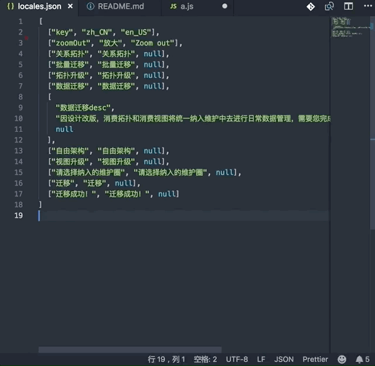

# everest-fanyi

## VS Code everest-fanyi

---

## Installation

In order to install an extension you need to launch the Command Pallete (Ctrl + Shift + P or Cmd + Shift + P) and type Extensions.
There you have either the option to show the already installed snippets or install new ones.

## Supported languages (file extensions)

- \*

## Usage

### 翻译单词

选中想要翻译的单词 按`cmd+t` (windows `control+t`)

### 翻译 everest local json 打开 json 进入编辑状态 按`cmd+t` (windows `control+t`)

